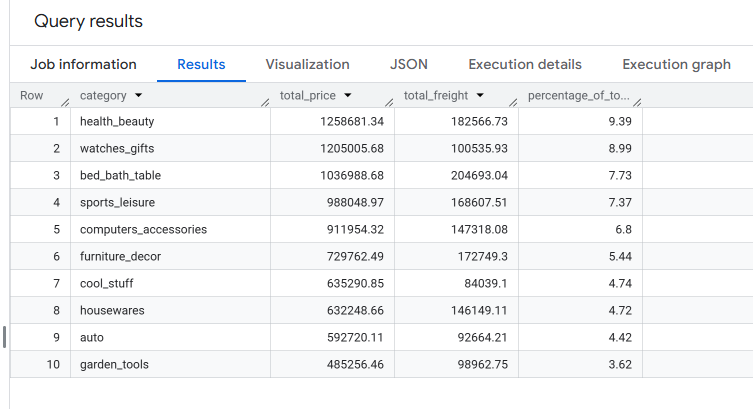
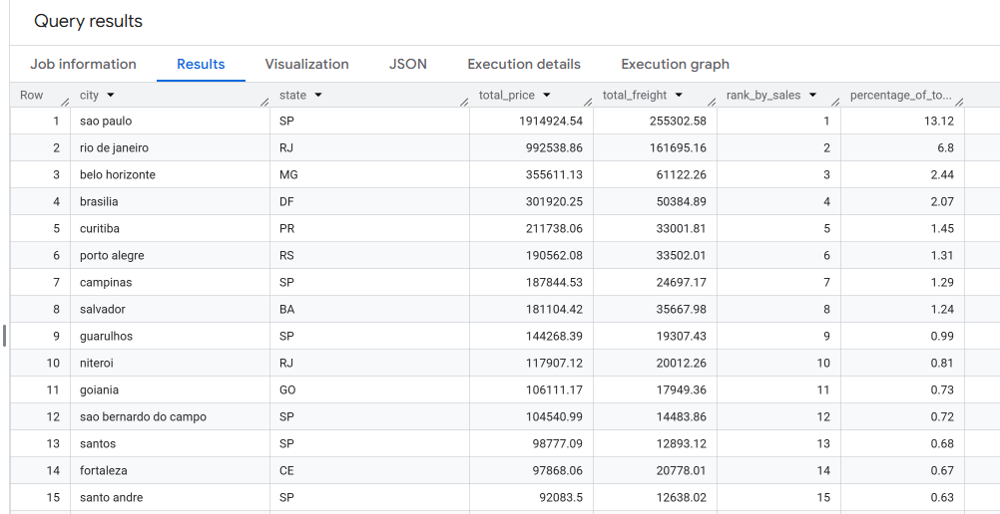

# SQL-sales-analysis
SQL portfolio focused on e-commerce data analysis using BigQuery. Includes projects on sales trends, customer insights, and performance analysis.

## Category Analysis

### 🔹 Objective
Analyze which product categories generate the highest total sales.

### 📌 SQL Query
[View Category SQL](category.sql)

### 📊 Result

### 🔍 Insight
- Top categories contribute the majority of total revenue
- Helps identify which products drive business performance

---

## City Analysis

### 🔹 Objective
Identify which cities generate the highest sales.

### 📌 SQL Query
[View City SQL](city.sql)

### 📊 Result

### 🔍 Insight
- Certain cities dominate overall sales
- Useful for targeting marketing and logistics strategies

